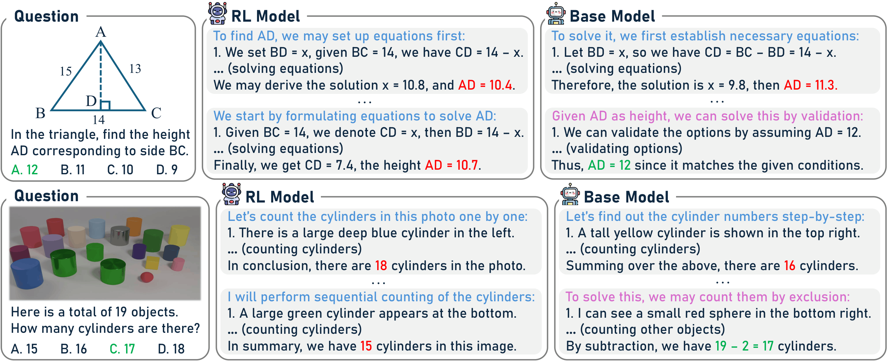
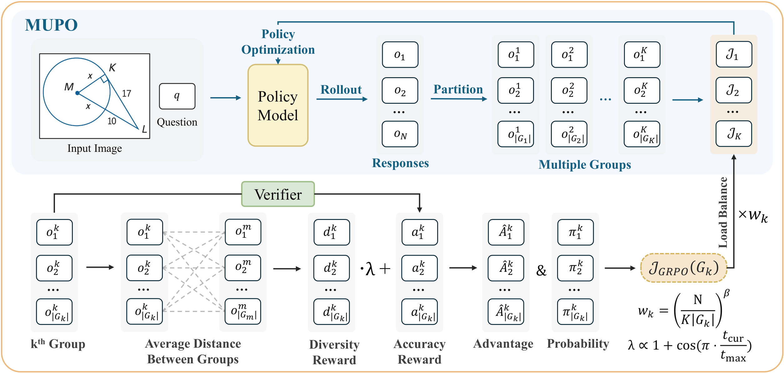
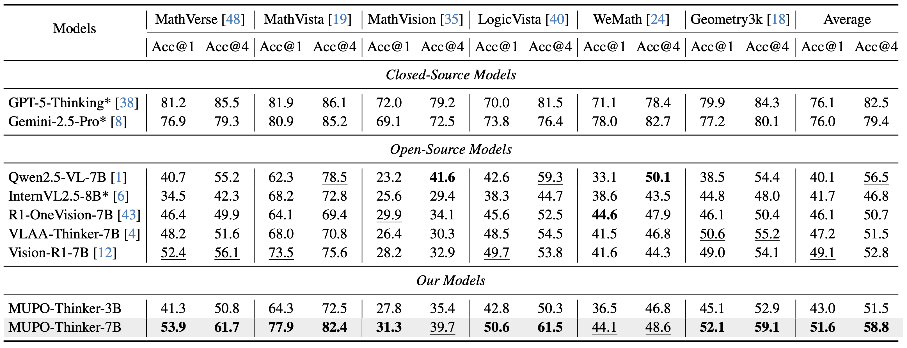

<div align="center">

# **All Roads Lead to Rome: Incentivizing Divergent Thinking in Vision-Language Models (CVPR 2026 Highlight)**

</div>

<p align="center"><i>We identify diversity collapse in GRPO-trained VLMs and propose MUPO, a simple drop-in replacement that incentivizes divergent reasoning across multiple solution strategies, achieving new state-of-the-art results.</i></p>

<div align="center">

[](https://xytian1008.github.io/MUPO/)
[](https://arxiv.org/abs/2604.00479)
[](https://github.com/xytian1008/MUPO)

</div>

This is the official implementation of the paper *'All Roads Lead to Rome: Incentivizing Divergent Thinking in Vision-Language Models'*.

# News📰

* **`[2025/04/07]`:** 🔥 **We have released our paper [[Arxiv](https://arxiv.org/abs/2604.00479)].**
* **`[2026/04/01]`:** 🔥 **We have released our code, models, and training datasets.**
* **`[2026/02/23]`:** 🎉 **Our paper has been accepted to CVPR 2026!**

# Key Findings🔍



**RL models dive depth, base models seek breadth.** When limited to a single attempt, RL models trained with GRPO generally outperform their base counterparts. However, when multiple samplings are permitted, base models consistently succeed in solving a broader range of problems by leveraging diverse and alternative reasoning pathways that RL models have discarded.

**Diversity collapse is the culprit.** During early GRPO training (within the first 20 steps), reasoning diversity drops sharply to a negligible level. The model prematurely converges on a narrow set of strategies while abandoning the vast majority of potential alternatives — before it has even seen most of the training data.

**Divergent thinking increases the odds of success.** Across all evaluated benchmarks, there is a strong positive correlation between reasoning diversity and acc@4. Tackling a problem through diverse strategies, rather than adhering to a single mode, significantly facilitates the discovery of correct answers.

# Methodology📖



We propose **Multi-Group Policy Optimization (MUPO)**, a drop-in replacement for GRPO that preserves divergent thinking throughout RL training. The key ideas are:

1. **Multi-Group Partitioning**: At each training step, the N sampled responses are partitioned into K groups using constrained clustering in the embedding space. Each group captures a distinct reasoning strategy.

2. **Localized Advantage Estimation**: Instead of normalizing advantages globally across all responses, MUPO computes mean and standard deviation within each group independently, allowing each strategy to be refined without being suppressed by dominant ones.

3. **Diversity Reward**: A diversity reward term encourages inter-group separation by rewarding responses whose reasoning embeddings are distant from those in other groups.

# Main Results🗒️

**MUPO establishes a new state of the art on mathematical benchmarks.**



✅ **MUPO-Thinker-7B** achieves an average acc@1 improvement of **+2.5%** (49.1% → 51.6%) over the previous best on mathematical benchmarks, and **+2.3%** (63.3% → 65.6%) on general-purpose benchmarks.

✅ **MUPO exhibits stronger test-time scaling**: MUPO-Thinker-7B outperforms existing strong RL baselines in acc@4 by **+6.0%** on mathematical and **+6.2%** on general-purpose benchmarks, demonstrating that divergent training directly translates to better parallel scaling.

✅ **MUPO-Thinker-3B** surpasses existing baselines at the same scale and achieves performance comparable to several strong 7B baselines under multi-sample evaluation.

# Getting Started🚀

## Installation

**Requirements:** Python ≥ 3.9, CUDA-compatible GPUs, `torch`, `vllm >= 0.8.0`, `transformers >= 4.51.0`.

```bash
git clone https://github.com/xytian1008/MUPO.git
cd MUPO
pip install -e .
```

## Dataset

We release the MUPO training data on Hugging Face, curated from [ViRL39K](https://huggingface.co/datasets/TIGER-Lab/ViRL39K).

| Split | HuggingFace Hub | Size |
|-------|----------------|------|
| Train | [🤗 xytian1008/MUPO-Thinker-train36k](https://huggingface.co/datasets/xytian1008/MUPO-Thinker-train36k) | ~36k |
| Val   | [🤗 xytian1008/MUPO-Thinker-val1k](https://huggingface.co/datasets/xytian1008/MUPO-Thinker-val1k) | ~1k |

## Pretrained Models

We release MUPO-Thinker checkpoints on Hugging Face:

| Model | Base | HuggingFace Hub |
|-------|------|----------------|
| MUPO-Thinker-7B | Qwen2.5-VL-7B-Instruct | [🤗 xytian1008/MUPO-Thinker-7B](https://huggingface.co/xytian1008/MUPO-Thinker-7B) |
| MUPO-Thinker-3B | Qwen2.5-VL-3B-Instruct | [🤗 xytian1008/MUPO-Thinker-3B](https://huggingface.co/xytian1008/MUPO-Thinker-3B) |

---

## Training

### Quick Start

The fastest way to reproduce the 7B result is to run the provided script directly. It assumes 8× A100-80G GPUs on a single node.

```bash
bash examples/qwen2_5_vl_7b_train36k_mupo.sh
```

For the 3B model:

```bash
bash examples/qwen2_5_vl_3b_train36k_mupo.sh
```

---

## Inference

MUPO-Thinker models are standard Qwen2.5-VL checkpoints and can be run with any Qwen2.5-VL-compatible inference stack.

### Using Transformers

```python
from transformers import Qwen2_5_VLForConditionalGeneration, AutoProcessor
from qwen_vl_utils import process_vision_info

model = Qwen2_5_VLForConditionalGeneration.from_pretrained(
    "xytian1008/MUPO-Thinker-7B",  # or a local checkpoint path
    torch_dtype="auto",
    device_map="auto",
)
processor = AutoProcessor.from_pretrained("xytian1008/MUPO-Thinker-7B")

messages = [
    {
        "role": "user",
        "content": [
            {"type": "image", "image": "path/to/image.jpg"},
            {"type": "text", "text": "Your question here.\n\nThink through the reasoning process enclosed within <think> </think> tags. Then provide your final answer enclosed within \\boxed{}."},
        ],
    }
]

text = processor.apply_chat_template(messages, tokenize=False, add_generation_prompt=True)
image_inputs, video_inputs = process_vision_info(messages)
inputs = processor(text=[text], images=image_inputs, return_tensors="pt").to(model.device)

output_ids = model.generate(**inputs, max_new_tokens=4096)
trimmed = output_ids[:, inputs["input_ids"].shape[1]:]
response = processor.batch_decode(trimmed, skip_special_tokens=True)[0]
print(response)
```

### Using vLLM

```python
from vllm import LLM, SamplingParams

llm = LLM(
    model="xytian1008/MUPO-Thinker-7B",
    dtype="bfloat16",
    max_model_len=8192,
)
# For divergent inference, sample multiple responses at temperature > 0
sampling_params = SamplingParams(temperature=1.0, max_tokens=4096, n=4)

prompt = (
    "<|im_start|>user\n"
    "<|vision_start|><|image_pad|><|vision_end|>"
    "Your question here.\n\n"
    "Think through the reasoning process enclosed within <think> </think> tags. "
    "Then provide your final answer enclosed within \\boxed{}."
    "<|im_end|>\n<|im_start|>assistant\n"
)
outputs = llm.generate(
    [{"prompt": prompt, "multi_modal_data": {"image": "path/to/image.jpg"}}],
    sampling_params,
)
# Use majority vote or best-of-n selection across the 4 candidates
for output in outputs[0].outputs:
    print(output.text)
```

> [!TIP]
> MUPO models are specifically trained to produce diverse solutions under sampling. We recommend using `temperature=1.0` with `n≥4` to take full advantage of the model's test-time scaling capabilities.

---

## Evaluation

Evaluation is handled via [VLMEvalKit](https://github.com/open-compass/VLMEvalKit), which is bundled in this repo. To run the benchmark suite used in the paper:

```bash
python run.py \
    --model MUPO-Thinker-7B \
    --data MMStar HallusionBench MMVet MathVerse MathVista MathVision LogicVista WeMath Geometry3K
```

To reproduce the acc@4 results (parallel sampling evaluation):

```bash
python run.py \
    --model MUPO-Thinker-7B \
    --data MathVerse MathVista \
    --nshot 4 \
    --temperature 1.0
```

---

# Acknowledgements🥰

Our training framework is built upon [EasyR1](https://github.com/hiyouga/EasyR1) and [veRL](https://github.com/volcengine/verl). Evaluation is powered by [VLMEvalKit](https://github.com/open-compass/VLMEvalKit). We train on [ViRL39K](https://huggingface.co/datasets/TIGER-Lab/ViRL39K) and evaluate on MathVerse, MathVista, MathVision, LogicVista, WeMath, Geometry3K, MMStar, HallusionBench, and MMVet. We gratefully acknowledge the computational support provided during this research.

# Citation🎓

If you find this work useful, please cite our paper:

```bibtex
@inproceedings{tian2026allroads,
  title     = {All Roads Lead to Rome: Incentivizing Divergent Thinking in Vision-Language Models},
  author    = {Tian, Xinyu and Zou, Shu and Yang, Zhaoyuan and He, Mengqi and Tu, Peter and Zhang, Jing},
  booktitle = {CVPR},
  year      = {2026}
}
```

# License📄

This project is licensed under the MIT License — see the [LICENSE](LICENSE) file for details.
